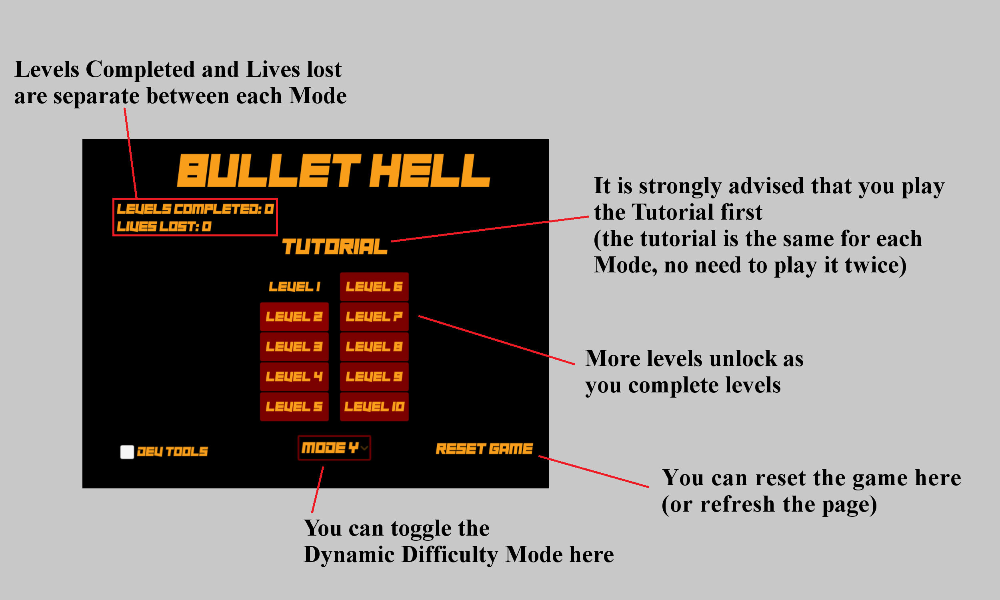

# BulletHell
This Game is created to test two different Dynamic Difficulty Adjustment Systems. These systems detect how well you are playing the game and adjust certain aspects of the game to make it easier or harder for you accordingly.

# Instructions

UPDATE: I am no longer collecting data

Thank you for agreeing to participate in my project. This will take about 30 minutes. Here's what you need to do:

- Below is a link to the game (Don't go there yet, keep reading). The game has 2 game modes, Mode X and Mode Y. While the mechanics of the game don't change between these gamemodes, the Dynamic Difficulty Adjustment System (DDA) used changes

- You can fullscreen the game by pressing F11. 

- This game can be played with keyboard & Mouse or Controller

- The game doesnt have any sound so I recommend listening to <a href="https://www.youtube.com/playlist?list=OLAK5uy_lxZ8ppOyfsh29l_IK8InEEB3z4C19iE3Y" target="_blank">this album by RichaadEB</a> while playing.

- I highly recommend you play through the tutorial first. It only takes about 30 seconds.

- Before you start playing, pick a game mode, either Mode X or Mode Y (they're at the bottom of the main menu)

- You do not need to beat each level on your first try. You can replay a failed level as many times as you want. That also means you can quit whenever you want, ~~and please do fill in the survey response whether you finish the game or not.~~

- ~~While playing, please think about how engaging the game is: how boring/challenging/frustrating is each level? You may want to go have a quick look at the survey before playing so you know what to be thinking about while playing~~

- ~~Once you are done playing the first Game Mode, please complete Sections 1 to 4 of the survey. If you do not wish to play the second Game Mode then answer no in Section 4 and click next to finish the survey.~~

- ~~If possible, please try both Modes. If you quit the first mode without completing it, please still try the second mode. You may want to take a break between playing each mode (but don't close your browser or you'll lose everything you've already entered into the survey). Remember that each game mode uses a different DDA system, so just because you found the first Game Mode too challenging doesnt mean the second will feel the same!~~

- ~~Once you have completed the second Game Mode, you can finish the remaining sections of the survey~~

- Thank you for your help!

# Play the game <a href="https://elliotmoffatt.github.io/BulletHell/" target="_blank">HERE</a>

# ~~Answer some questions about the experience HERE~~
# Thank you to those of you that provided feedback

# The <a href="https://github.com/ElliotMoffatt/BulletHell/blob/master/DDA%20with%20Limited%20Player%20Data%20by%20Elliot%20Moffatt.pdf" target="_blank">Report</a> and <a href="https://github.com/ElliotMoffatt/BulletHell/blob/master/a2poster.pdf" target="_blank">Poster</a> are now available

